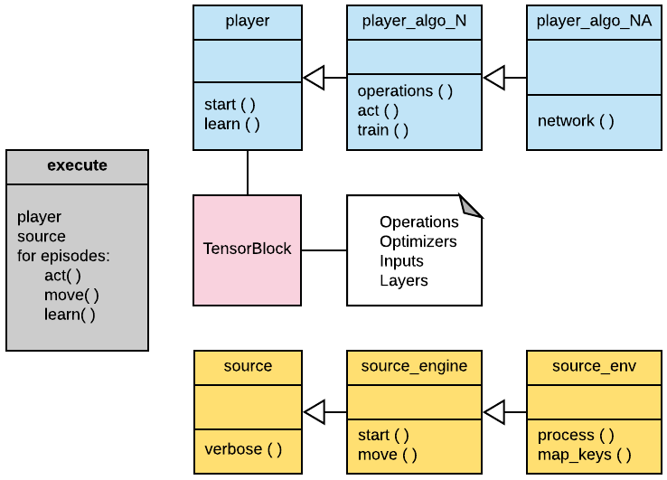

# A unified framework of Deep Reinforcement Learning and Deep Imitation Learning in simulation environments

This open source software enables experiments of Deep RL and IL algorithms in many integrated environments, for simulation and analysis with a unified framework. This scalable system is built using TensorFlow and the TensorBlock API.

Experiments can be run in many available simulation platforms, and some visualization of performace obtained.

 

 

The structure of the system is shown below, where the blue boxes refers to the learning algorithm, and the yellow to the simulation environment.

## Background

 

   **Reinforcement learning** is an area of Machine Learning in which an agent interacts with an environment, usually formulated as a Markov Decision Process (MDP): At each time **t**, the agent receives an observation **o(t)**, and a reward **r(t)**. It then chooses an action a **a(t)**, which is sent to the environment. The environment moves to a new state **s(t+1)**. The goal of the Reinforcement Learning agent is to learn a policy to maximize received rewards.

   **Imitation learning** is an area of Machine Learning in which an agent interacts with an environment, usually formulated as a Markov Decision Process (MDP), without a reward signal provided by the environment. The goal of the Imitation Learning agent is to learn a policy to imitate some demonstrated behavior from another agent in the form of trajectories, usually a dataset of seen states and taken actions. IL can be divided in Behavioral Cloning, which performs Supervised Learning from observations to actions and Inverse Reinforcement Learning, where a reward function that explains the demostrations is recovered.

## Algorithms:

The **Reinforcement Learning** algorithms currently implemented are:  

- [Deep Q-Learning](docs/QLearning.md)
- [REINFORCE](docs/REINFORCE.md)
- [Actor Critic](docs/ActorCritic.md)
- [Deep Deterministic Policy Gradients (DDPG)](docs/DDPG.md)
- [Proximal Policy Optimization (PPO)](docs/PPO.md)

The **Imitation Learning** algorithms currently implemented are:  

- [Dataset Aggregation (DAgger)](docs/DAgger.md)  
- [Generative Adversarial Imitation Learning (GAIL)](docs/GAIL.md)  

## Simulation platforms:

The simulation platforms currently integrated are:

- OpenAI's Gym
- OpenAI's Gym MuJoCo
- PyGame
- Unity Machine Learning
- CARLA
- V-Rep

The datasets currently avaliable are:

- Gym Cartpole
- Unity 3DBall
- Gym HalfCheetah

See the documentation: [Environments](docs/Environments.md)

## Usage with Tensorblock

See the documentation: [Usage](docs/Usage.md)

## Results

The [statistics](statistics/) folder is used to save trained models and metric's outputs of the training.

## Dependencies

- Python 3.5
- Tensorflow 1.4
- Pygame 1.9.3
- OpenCV-Python 3.3.0.9
- NumPy 1.13.1
- Gym 0.10.3
- MatplotLib 2.0.2
- Unity ML 0.3
- MuJoCo 1.50
- CARLA 0.8.3

## Bibliography

- [Bibliography](docs/Bibliography.md)

## Contributions

Are more than welcome!

## Acknowledgement

I acknowledge Vitor Guizilini, the creator of the TensorBlock API. Many thanks for his guidance and support. Also, I thank Professor Dr. Glauco Caurin and all colleagues from the Mechatronics Laboratory of the São Carlos School of Engineering / University of São Paulo, and the support from CNPq. Also, thanks to all contributors.

## Videos

Some videos are available: [YouTube](https://www.youtube.com/watch?v=cEcCHs1GGpg)
