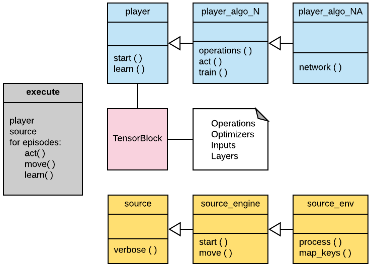
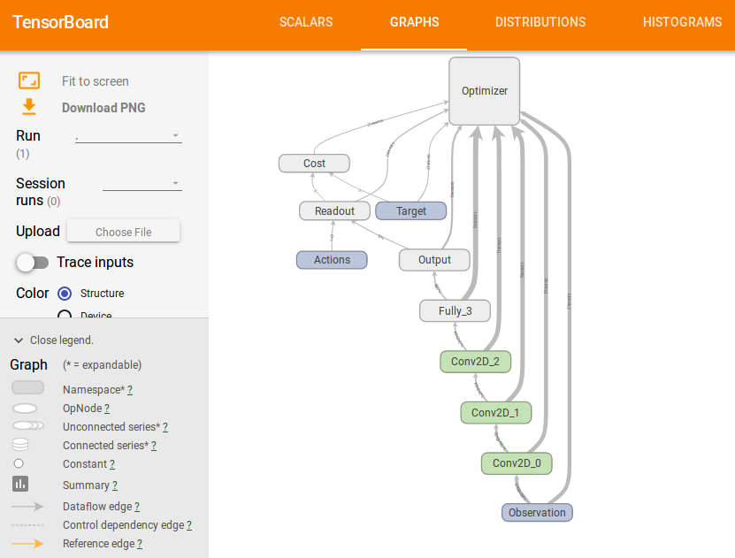

# Usage

## Overview

In the [*learning*](../learning/) folder, [*players_reinforcement*](../learning/players_reinforcement/) or [*players_imitation*](../learning/players_imitation/) contains the the learning algorithms, that consists of two files, one for the core algorithm, describing the *agent* operations and training, and one for the neural network model used.  

Also in the [*learning*](../learning/) folder, [*sources*](../learning/sources) contain the files that are the interface to the simulation platforms, like the OpenAi's Gym, Pygame, Mujoco or Unity.  

The [*tensorblock*](../tensorblock) folder cointains all the functions and classes that facilitates the implementation of the algorithms.

The [*execute*](../learning/execute.py) file runs it all.

<div align="center">

</div>


## Commands

The algorithms are trained using the command:
```shell
python execute.py type source player
```

type = *reinforcement* or *imitation*  
source = *source_your_source*  
player = *player_your_player*   

There are some flags that can be used:  

```shell
--save *your_saved_model_name*  
--load *your_saved_model_name*
--run (just run and do not train the model)  
--epis (define maximal episodes)
--record (save trajectories)
```
There are many [**scripts**](../learning/scripts/) to facilitate usage, and  saved [**trained_models**](../learning/trained_models/).
Please run the scripts from [**learning**](../learning/) the folder, e.g.: ./scripts/script.sh

## TensorBlock

Tensorblock is an API to facilitate the implementation of Machine Learning Algorithms using TensorFlow: [BitBucket/TensorBlock](https://bitbucket.org/vguizilini/tensorblock/overview).

## TensorBoard

TensorBoard is easy to use. It is implemented in some algorithms, such as in [reinforce_2](REINFORCE.md), and can be easily reproduced in others.

<div align="center">



</div>
